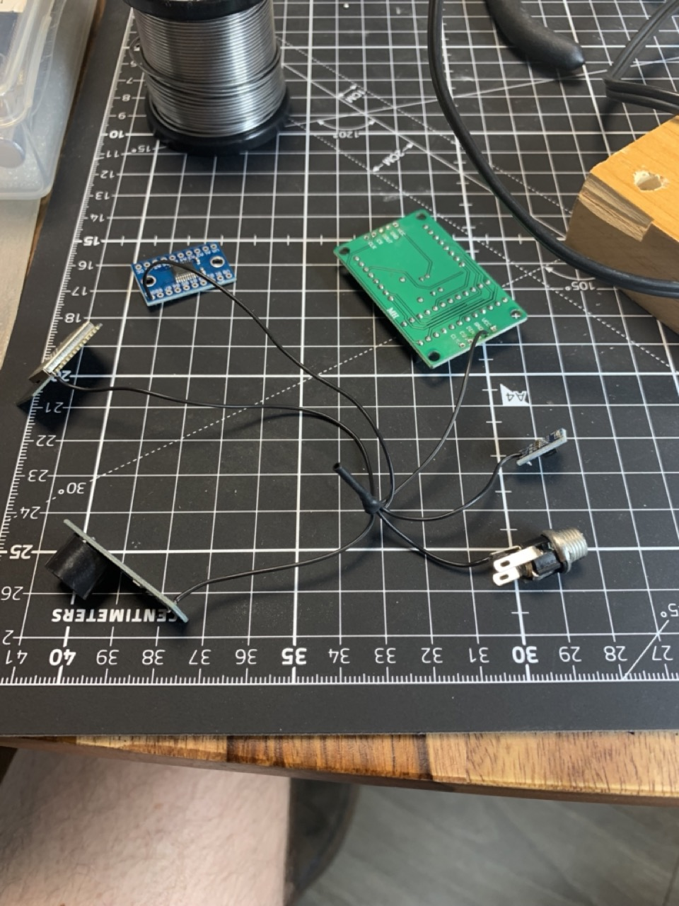
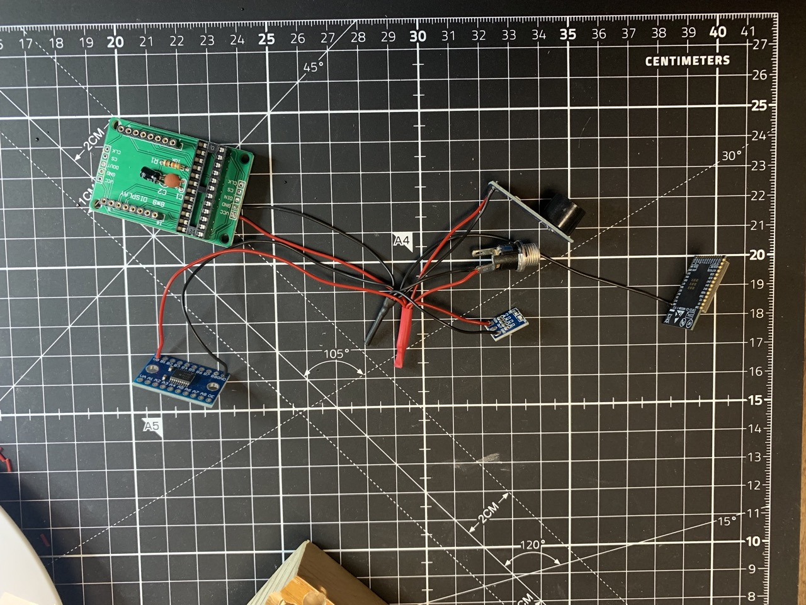
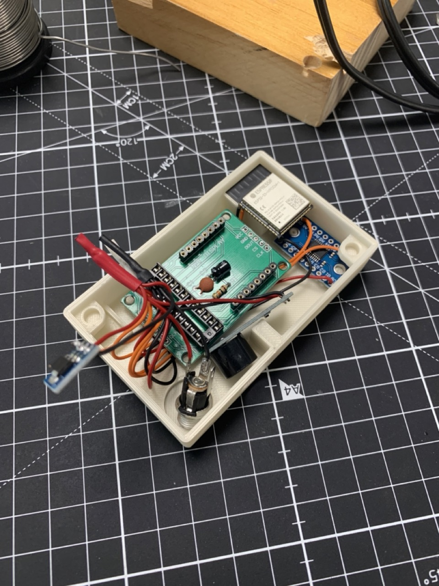
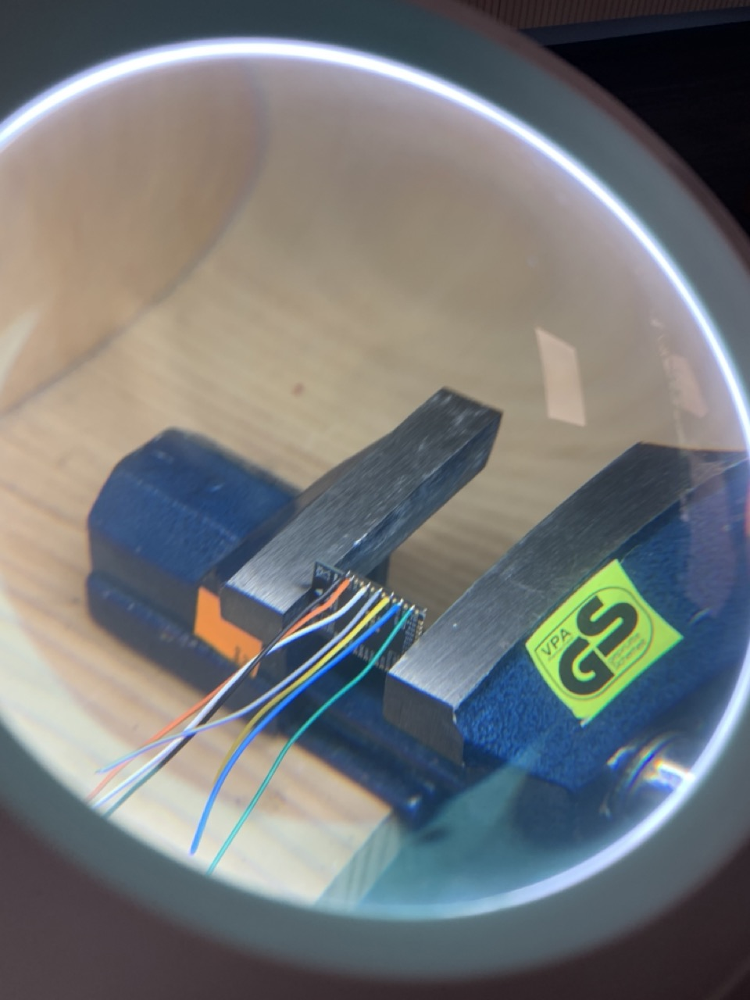
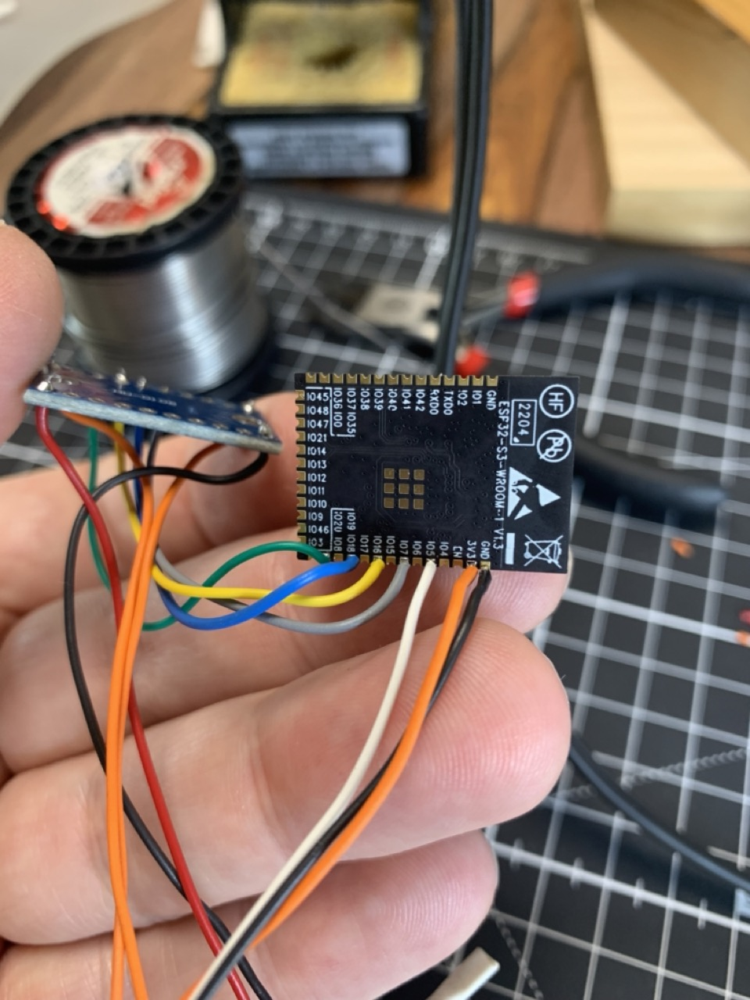
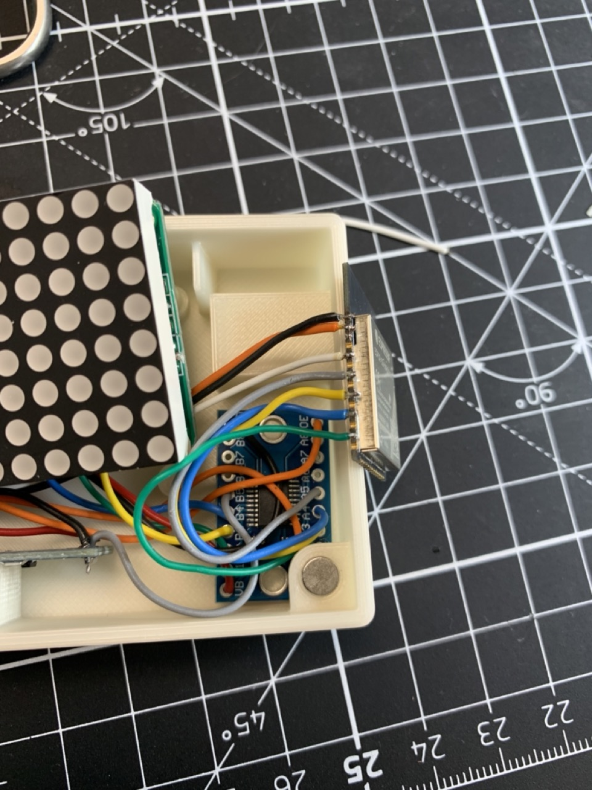
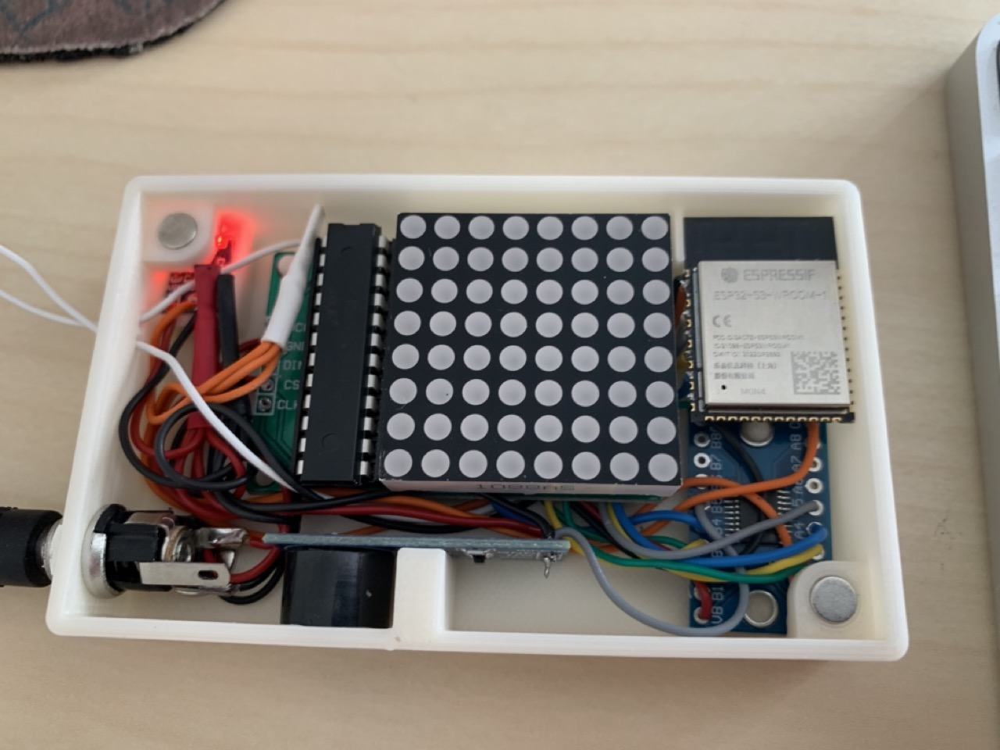
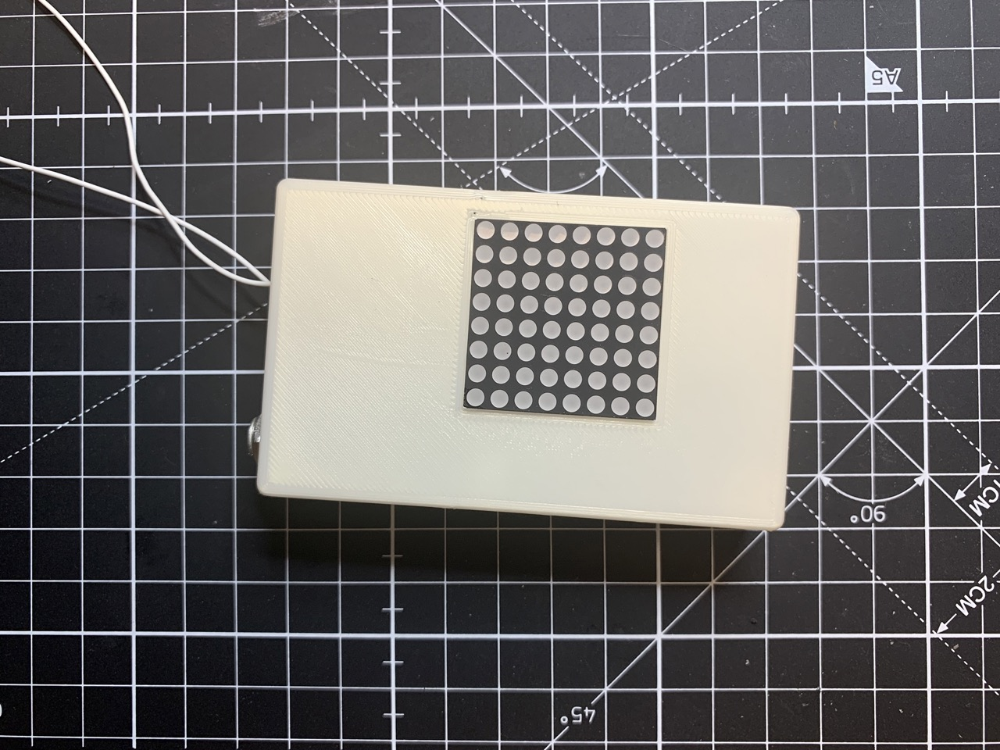

# Nevera - Fridge Alarm

## Introduction

We experienced an issue with our fridge where the door was difficult to open immediately after it had been closed. This is due to the fact that the cold air inside the fridge reduces in volume, causing the rubber on the door frame to take longer to fill the void. If you try to open the door too early, it puts additional strain on the rubber. In order to address this issue, we have developed a device that serves several purposes.

## Demo

Check out this video: <https://youtu.be/vCrqtjIsVMY>. The first 30 seconds show the device operating normally, while the rest of the video demonstrates a bug that we have yet to fix.

## Project Goals

1. Sound a loud alarm if the fridge door is opened too early (the time can be adjusted)
1. Inform the user how long they should wait to open the door
1. Provide information to a home automation system (HA) about the status of three sensors:
   1. Main door sensor (open/closed)
   1. Wait time sensor (on/off)
   1. Alarm sensor (on/off)
1. In addition to the above sensors, We have also added a statistics sensor to the HA to track the following information over the past 24 hours
   1. The number of times the firdge door was opened/closed
   1. The amount of time the fridge door was left open

## Bill of Materials (BOM)

- ESP32 single chip
- MAX7219 8x8 LED matrix - used as the main display (communication via SPI protocol)
- Voltage regulator to 3.3v - (used to power the ESP32 with an external 5v power supply)
- Active buzzer (alarm - Google "MH-FMD")
- 8 channel bi-directional logic level converter (Google "HW-0108")
- Reed Switch Sensor Magnetic (and magnet)

## Images

Wiring phase:

## Schematics

TODO

## Case stl for 3d printing

TODO

## Prerequisites

- ESPHome development environment <https://esphome.io/index.html>

## Installation instructions

To install the device, simply copy the file 'nevera.yaml' to your ESPHome development environment and burn it onto a chip.
